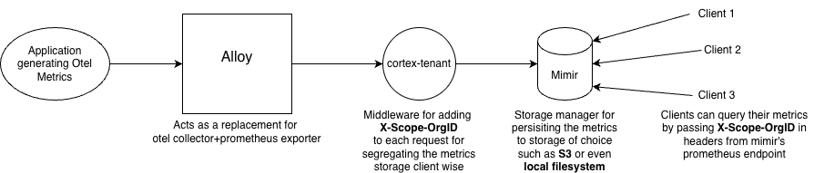

# OpenTelemetry POC

This is a proof of concept application demonstrating OpenTelemetry metrics collection and visualization using Grafana Alloy, Mimir, and Grafana.



## Architecture

The application consists of:

- **Go API Application**: A test API server that generates metrics and sends them via OTLP
- **Grafana Alloy**: Receives OTLP metrics and forwards them to Prometheus remote write
- **Cortex Tenant**: Multi-tenant proxy for metrics
- **Mimir**: Metrics storage backend
- **Grafana**: Metrics visualization dashboard

## Prerequisites

- Go 1.24.5 or later
- Docker and Docker Compose
- Make (optional, for convenience commands)

## Setup

### 1. Install Dependencies

```bash
go mod download
```

### 2. Start Infrastructure Services

Start all the infrastructure services (Alloy, Cortex Tenant, Mimir, and Grafana) using Docker Compose:

```bash
docker-compose up -d
```

This will start:
- **Alloy** on ports `4317` (gRPC), `4318` (HTTP), and `9464` (metrics)
- **Cortex Tenant** on port `8085`
- **Mimir** on port `9009`
- **Grafana** on port `3000`

### 3. Verify Services are Running

Check that all services are up:

```bash
docker-compose ps
```

You should see all services in "Up" status.

### 4. Run the Application

Build and run the Go application:

```bash
cd cmd/api_test
go run .
```

The application will start on port `8088` and automatically send metrics to the OTLP endpoint at `http://localhost:4318`.

## Usage

### Test the API

The application exposes a single endpoint:

```bash
# Basic request
curl http://localhost:8088/api

# Request with custom status code
curl http://localhost:8088/api?sc=404

# Request with Client-ID header (for multi-tenant testing)
curl -H "Client-ID: 11111" http://localhost:8088/api
```

The API will:
- Return a response with a random delay (0-500ms)
- Accept a `sc` query parameter to return different HTTP status codes
- Accept a `Client-ID` header for tenant identification
- Automatically send OpenTelemetry metrics for each request

### Access Grafana

1. Open your browser and navigate to `http://localhost:3000`
2. Login with:
   - Username: `admin`
   - Password: `admin`
3. Configure Mimir as a data source:
   - Go to Configuration → Data Sources
   - Add a new Prometheus data source
   - Set URL to `http://mimir:9009`
   - Save and test the connection

### View Metrics

After making some API requests, you can query metrics in Grafana:

- Navigate to Explore
- Select your Mimir data source
- Query for metrics like:
  - `http_server_request_duration_seconds`
  - `http_server_request_total`
  - Custom metrics from your application

## Configuration

### Application Configuration

The application is configured via environment variables (set in `main.go`):

- `OTEL_EXPORTER_OTLP_ENDPOINT`: OTLP endpoint (default: `http://localhost:4318`)
- `OTEL_EXPORTER_OTLP_PROTOCOL`: Protocol to use (default: `http/protobuf`)

### Alloy Configuration

Alloy configuration is in `config.alloy`. It:
- Receives OTLP metrics on ports 4317 (gRPC) and 4318 (HTTP)
- Exports metrics to Prometheus remote write via Cortex Tenant

### Mimir Configuration

Mimir configuration is in `mimir.yaml`. It stores metrics in the local `mimir-data` directory.

### Cortex Tenant Configuration

Cortex Tenant configuration is in `cortex-tenant.yaml`. It handles multi-tenant routing of metrics.

## Stopping Services

To stop all services:

```bash
docker-compose down
```

To stop and remove all data (including Mimir blocks):

```bash
docker-compose down -v
```

## Troubleshooting

### Application not sending metrics

- Verify Alloy is running: `docker-compose ps`
- Check Alloy logs: `docker-compose logs alloy`
- Verify OTLP endpoint is accessible: `curl http://localhost:4318`

### Metrics not appearing in Grafana

- Verify Mimir is running: `docker-compose ps`
- Check Mimir logs: `docker-compose logs mimir`
- Verify Grafana data source is configured correctly
- Check Cortex Tenant logs: `docker-compose logs cortex_tenant`

### Port conflicts

If any ports are already in use, modify the port mappings in `docker-compose.yml`.

## Development

### Project Structure

```
.
├── cmd/api_test/          # Go application source
│   ├── main.go           # Application entry point
│   ├── router.go         # HTTP router setup
│   ├── http.go           # HTTP handlers
│   ├── metrics.go        # Metrics instrumentation
│   └── container.go      # Dependency injection
├── config.alloy          # Grafana Alloy configuration
├── cortex-tenant.yaml    # Cortex Tenant configuration
├── mimir.yaml            # Mimir configuration
├── docker-compose.yml    # Infrastructure services
└── mimir-data/           # Mimir storage (created at runtime)
```

## License

This is a proof of concept project for demonstration purposes.
